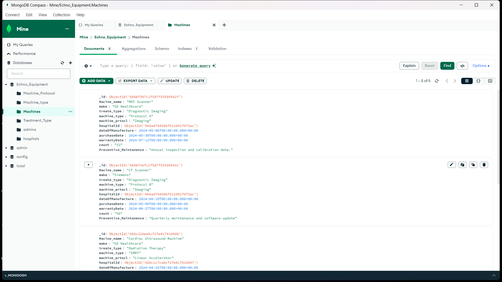

# Integrated Hospital Equipments Management Module

## Project Overview

The Integrated Hospital Equipment Management Module is designed to manage the preventive maintenance of hospital machines and equipment. This system is a part of a larger hospital management System.

## Features 

- **Preventive Maintenance**:Tracking of maintenance tasks.
- **User Roles**: Different access levels for administrators, managers, and technicians.

## Technology Stack

- **Frontend**: React
- **Backend**: Node.js, Express.js
- **Database**: MongoDB

## Installation

1. **Clone the repository**
    ```sh
    git clone 
    cd EONCO_MACHINES_022
    ```

2. **Install dependencies for the backend**
    ```sh
    cd server
    npm install
    ```

3. **Install dependencies for the frontend**
    ```sh
    cd ../client
    npm install
    ```

4. **Set up environment variables**

    Create a `.env` file in the backend directory with the following content:
    ```plaintext
    PORT=5000
    MONGODB_URI=your_mongodb_connection_string
    ```

5. **Run the backend server**
    ```sh
    cd server
    npm start
    ```

6. **Run the frontend development server**
    ```sh
    cd ../client
    npm start
    ```

## Usage

1. **Access the Application**
    Open your web browser and navigate to `http://localhost:3000`.

2. **Log in with appropriate credentials**
    - Admin
    - Manager
    - Physist

3. **Navigate through the dashboard**
    - View upcoming maintenance tasks
    - Monitor equipment status

## **Screenshots**

<br>

1.**Login Page**

<br>
  
  <br>
  
2.**Admin Dashboard**

<br>
  

3.**Machines Add Page**

<br>
  

<br>

4.**Physist Dashboard**

<br>
  

<br>

5.**Database**

<br>
  

<br>

